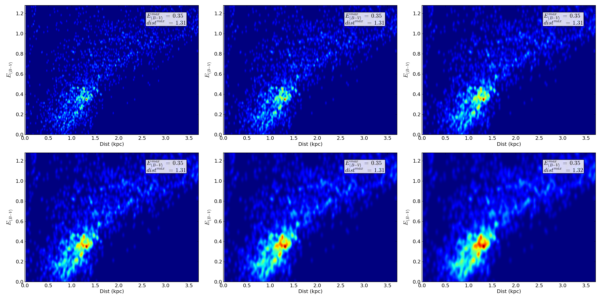
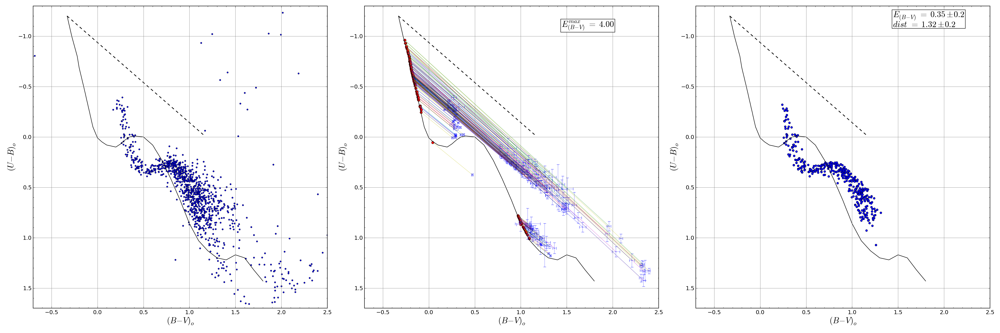

UBV-Move
=============

Moves stars in a UBV color-color diagram to their intrinsic position over a
given ZAMS. Uses an interpolated [Schmidt-Kaler (1982)][1] ZAMS and the standard
extinction law:

    E(U-B) = 0.72*E(B-V) + 0.05*E(B-V) ** 2

The code stores all possible solutions for each observed star, ie: all `E(B-V)`
values that move the star over the ZAMS according to the extinction law. Each
extinction solution positions the star at a given distance, with fixed values
for its absolute magnitude and spectral type.

Dirty code, definitely needs improvement. Works nonetheless.

### Install

Download the [latest release][2] of the code, unzip it, and move inside the
code's folder in a terminal session (`$ cd UBV_move`). Python 3 is required
to run the code. First install the `pip` tool with:

    $ sudo apt-get install python3-pip

Then install the necessary requirements with:

    $ python3 pip install -r requirements.txt

### Running

From a terminal the code can be executed with the command:

    python3 UBV_move.py

Alternatively you can also pass a name for the cluster and a maximum value of
`E(B-V)` extinction to be used  with:

    python3 UBV_move.py NGC001 3.5

If no name or maximum extinction value are passed the code will assume `cluster`
and `4.` respectively by default.

### Input

The code expects an input photometric data file named `data_input.dat` to exist
in the `input/` folder. The format of the columns in the file should follow the
order:

    ID  x  y  V  e_V  (B-V)  e_BV  (U-B)  e_UB

Any extra columns will be ignored.

### Output

The code outputs a text file named `clustname_stars_out.dat` (where
`clustname` is the name assigned when calling the code) with all the solutions
found for each star which includes extinction, distances, absolute magnitudes
and spectral types.

Two figures are also created, the first one is `clust_name_dens_map.png`,
see **Fig. 1**, and shows a density map of all the extinction and distance
values found for all the observed stars in the CMD in various bin sizes. The
maximum density value is displayed and assumed as the most likely extinction and
distance values for the cluster.

**Fig. 1** *Density map of extinction vs distances values showing all possible
solutions for all the observed stars.*

The second figure is called `clustname_CMD.png`, see **Fig. 2**, and shows the
observed CMD (left), the new positions of stars over the ZAMS (center, only for
those stars with a unique solution) and a CMD showing only those observed stars
with at least one solution including extinction and distance values within a
given range of the most likely extinction and distance values assumed for the
cluster (right).

**Fig. 2** *Left: CMD of observed cluster. Center: Stars with unique solutions
placed over the main sequence. Right: Only stars with distance and extinction
values close to the maximum density value in the density map.*

[1]: http://www.fcaglp.unlp.edu.ar/~egiorgi/cumulos/herramientas/tracks/zams.txt
[2]: https://github.com/Gabriel-p/UBV_move/releases/latest